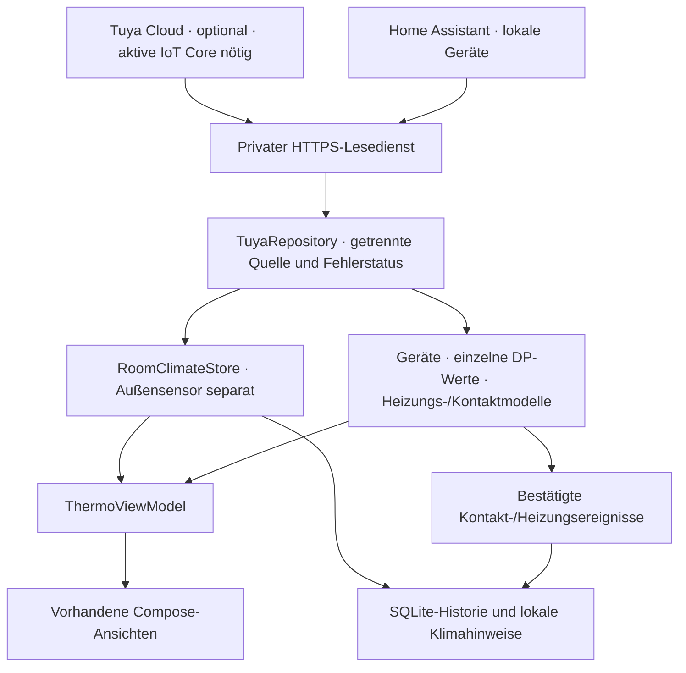

# V11.26 – Datenarchitektur und Gerätezuordnung

Stand 3. Oktober 2026. Bestehende Compose-Navigation, Raumfotos und Layouts bleiben
bestehen. Die zusätzliche Einrichtung/Diagnose liegt innerhalb der Geräteseite;
Raum-/Außendaten werden in vorhandene Felder eingesetzt. Ein vorhandener V11.26-
Bildwechsel zu blauem Sonnenhimmel ist enthalten; die ziehenden Wolken sind unverändert.

## Implementiert

- HTTPS-Leseclient in Android; keine API-Aufrufe aus Compose. Einrichtung ruft
  Repository-Methoden auf, kein UI-Code baut Tuya-Requests.
- Backend mit HMAC-SHA256, zeitlich begrenztem RAM-Token, einmaliger Erneuerung bei
  Tokenfehler. Keine Secret-Ausgabe und keine Geräte-Schaltroute.
- Zugriffsschutz durch separates Backend-Lesetoken; nur dieses wird in Android
  mit Keystore AES-GCM verschlüsselt. Sicherung/Übertragung der entsprechenden
  Preferences ausgeschlossen. Tuya-/HA-Credentials bleiben im Backend.
- Explizite Quelle DEMO oder LIVE; konkrete Live-Quelle TUYA LIVE oder HOME
  ASSISTANT LOCAL wird angezeigt. Keine erfundenen Live-Messungen bei Fehlern.
- Bekannte Geräte zunächst unverifiziert; ausschließlich exakt in der Account-
  Geräteliste gefundene IDs werden von Tuya bestätigt. Kein Raten bei Abstellraum-ID.
- DP-Schema für Typ, Einheit, Scale und Read/Write dynamisch. Keine pauschale
  Division durch zehn. Integer-Rohwerte nur mit explizitem Scale; bereits
  skalierte HA-Werte werden nicht erneut skaliert. Tuya-Dezimal-/String-Werte
  bleiben ohne bestätigten Rohwertvertrag Diagnosewerte.
- Einzelne Sensorwerte bleiben pro Gerät/DP im Snapshot. Raum-Mittelwerte aus
  frischen online/validierten Klimasensoren; Medianfilter ±3 °C/±15 Prozentpunkte.
  Zwei deutlich widersprüchliche Sensoren erzeugen keinen willkürlichen Mittelwert.
  Ausschlüsse im Backend-Snapshot. Thermostattemperaturen sind kein Ersatz für
  Raum-T&H-Sensoren. RH 0 erzeugt wegen undefiniertem Taupunkt keinen Raumwert.
- Außensensor `outside` separat für Lüftung, Timerplanung und Anzeige. Ohne
  frischen lokalen Sensor bleibt vorhandenes explizites Open-Meteo-Modellwetter
  nutzbar; fehlen auch Wetterdaten, bleibt die vorhandene Beratung eine Demo-Vorschau.
- Power, Solltemperatur, Thermostattemperatur und aktive Heizphase getrennt.
  Ein eingeschaltetes Gerät mit `heat_off` erscheint nicht als heizend.
- Echte Fensterkontakte primär; HY18-`Windows Open` wird nicht als Kontakt genutzt.
  Nur bekannte Open/Closed-Enums beziehungsweise Standard-Boolean-Kontakt-DP.
  Unbekannte Enums bleiben unbekannt. Erstabruf erzeugt kein rückwirkendes Lüften.
- Bühnenfenster zusätzlicher Querlüftungskontakt für Kinderzimmer, ohne Klima-
  Zusammenlegung. Haustür ohne eindeutige Raumzuordnung bleibt in Diagnose.
- CO-DP eigener Kanal mit frischen bestätigten Alarm-/Normalzuständen. Lokale
  Android-Warnung bei Alarm und erteilter Benachrichtigungsfreigabe. Kein
  zertifiziertes CO-System; Polling bietet keine zuverlässige Alarmüberwachung.
- Bei Offline, unbekanntem Wert, fehlender Berechtigung, Timeout oder Rate Limit
  bleiben letzte bekannte Werte samt Messzeit erhalten und werden gekennzeichnet.
  Wenn Tuya eine verknüpfte Gateway-ID und Offline-Zustand liefert, wird auch
  das zugeordnete Subdevice nicht als online angenommen.
- Foreground-Lifecycle-Abfrage alle fünf Minuten; kein kompletter App-Neustart
  bei Messwerten. Einzelne Räume beobachten ihren jeweils relevanten StateFlow.
  Weiterlaufende bestehende Timer behalten den Hintergrunddienst.

## Gerätebestand und verifizierte Grenzen

47 eindeutige IDs: 10 T&H, 12 Fenster, 10 Heizungen, 3 CO, 1 Haustür, 11 Diagnose.
`backend/devices.json` ist die vollständige Zuordnung mit Nutzerangaben.
`docs/Tuya_Geraetemapping_V11.26.csv` listet bekannte DPs und **API verifiziert: nein**.
Erwartete Produktnamen sind keine ermittelten Product IDs. Keine Geräteliste wurde
hier mit echten Credentials geladen. Daher **0 physische Geräte API-verifiziert**
und **0 DP-Mappings durch echte Cloud-Antworten bestätigt**.

Nach Verbindung liefert der authentifizierte Backend-Endpunkt `/v1/mapping.csv`
die tatsächliche Mapping-Tabelle mit Product ID, Category, Typ, Einheit, Scale,
Read/Write und API-ID-Bestätigung. Geräte-ID-Bestätigung ist noch kein Beweis für
korrekte Skalierung: Messzeiten und Normalisierung zusätzlich in Diagnose prüfen.

Offene Produkt-DPs (z.B. tatsächlicher HY18-Heat-Code statt sichtbarer UI-Bezeichnung)
werden nicht geraten. Die dynamische Diagnose zeigt sie an; nach echter Prüfung
lassen sich unterstützte Alias-Codes gezielt ergänzen. Gleiches gilt für CO-Enums.

## Noch offen

- Echter Tuya-Authentifizierungs-/Geräte-/DP-Test, aktive IoT-Core-Verlängerung,
  Account UID und Service-API-Autorisierung. Aktuelle Tuya-Portal-Dokumentation ist
  aus der Cloud-Umgebung blockiert; Lizenzdetails und Shadow-Routenschema müssen
  beim ersten echten Verbindungsversuch geprüft werden.
- Home-Assistant-Installation, Zigbee-Koordinator und Kompatibilitätsprüfung der
  einzelnen Geräte. Noch keine lokale Gerätekopplung erfolgt.
- Deployment des privaten Backend-Dienstes und HTTPS im Heimnetz. Mitgelieferte
  Konfigurationen sind Beispiele und enthalten keine erfundenen Credentials.
- Echte Live-Events und kontinuierliche Geräteüberwachung im Hintergrund.
  Zwischen Polls können Kontakte/Heizphasen verloren gehen. Kein Cloud-Push/FCM.
- Schreibende Steuerung/AUTO-Heizung ist nicht aktiv. Ownership-Enum vorbereitet,
  aber manuelle Übernahmeregeln, Speicherung und sichere Gerätebefehle benötigen
  eigene Umsetzung/Tests. Vorrang manueller Eingriffe wird daher noch nicht durch
  eine aktive Automatik in Frage gestellt.
- Historie einzelner Rohsensoren: aktuelle Einzelwerte bleiben im Geräte-Snapshot,
  die bestehende SQLite-Historie speichert den aggregierten Raumwert.
